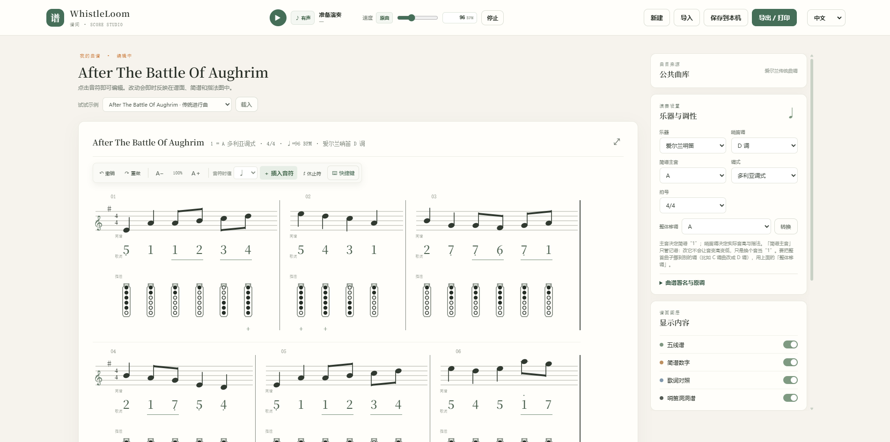

# WhistleLoom

六孔哨笛曲谱工作台。由同一份曲谱数据渲染五线谱、简谱、歌词与六孔指法四层，在同一个横向网格内对齐。

纯静态、零构建：用浏览器打开 `index.html` 即可使用，无安装步骤、无账号、无服务端依赖，也不需要打包工具。

- 在线版：<https://roxy-dd.github.io/WhistleLoom/>
- 许可：代码 AGPL-3.0，内置曲库 ODbL 1.0，详见[许可与数据来源](#许可与数据来源)



## 运行

在线版直接访问上面的地址。

本地使用时用现代浏览器打开 `index.html`。曲谱与编辑记录保存在浏览器本机存储中，不需要联网，也不需要起本地服务器。

两种方式加载的是同一份文件，没有构建步骤，也没有服务端差异。

## 功能

### 编辑

- 在右侧面板选择音高与时值后添加音符或休止符，也可用「1–7」简谱音级按钮快速录入
- 点击谱面、简谱、歌词或指法区中的音符选中，再在右侧面板修改音高、时值与歌词
- `↑` `↓` 微调选中音符，`Delete` 删除，`Ctrl/Cmd+Z` 撤销，`Ctrl/Cmd+Y` 重做
- 谱面上方 `A−` / `A＋` 调整字号；小节按可用宽度自动并排
- 可切换乐器调、简谱主音与调式，可分别显示或隐藏四层中的任意一层

### 播放

顶部播放器播放与暂停。有声 / 静音可在演奏过程中切换，不打断播放进度与谱面跟随。

速度有两个入口，写入同一个值：滑杆用于连续调整，数字框用于直接输入（选中后也可用 `↑` `↓` 微调）。数字框允许 20–400 BPM，超出范围的值在离开输入框时收回；滑杆行程会自动扩展以覆盖当前值。「原曲」按钮恢复导入时记录的速度。

### 导入 / 导出

顶部「导入」与「导出 / 打印」是同一个面板的两个页签。

格式清单、文件选择框的 `accept` 后缀、拖放时的分流，均由 `js/formats.js` 中的一张登记表生成。

| 格式 | 后缀 | 导入 | 导出 | 说明 |
| --- | --- | --- | --- | --- |
| ABC 记谱 | `.abc` `.txt` | 是 | 是 | 纯文本；再导入时少数记法会有损失 |
| MusicXML | `.musicxml` `.xml` `.mxl` | 是 | 是 | 记谱软件互通标准，MuseScore / Sibelius / Finale / Dorico 可直接打开 |
| MIDI | `.mid` `.midi` | 是 | 是 | 只保留音高与节奏，歌词会丢失 |
| WhistleLoom 工程文件 | `.json` | 是 | 是 | 无损 |
| 可逆 PDF | `.pdf` | 是 | 是 | 整曲单页长谱面，曲谱数据嵌入文件，导入可还原 |
| 可逆 PNG | `.png` | 是 | 是 | 整曲长图，同样嵌入可还原的数据 |
| 普通打印 | — | 否 | 是 | 走浏览器分页流程 |

文件可以拖放到页面任意位置，也可以通过「选择文件…」导入。

分流按内容优先、后缀兜底：先识别魔数（`%PDF` / `\x89PNG` / `PK` 打包的 `.mxl` / `MThd`），非二进制内容按文本嗅探；内容无法识别时才退回后缀。

导入时的取舍（时值吸附、延音线降级为连奏线、装饰音略去、整段移八度等）会列在谱面上方的提示条中，需手动关闭。提示条位于谱面之外，不参与打印与导出。

导出按右侧当前开启的图层排版，面板中会列出本次导出包含的图层。

标为「可逆」的三种格式（JSON / PDF / PNG）嵌入完整曲谱数据，导入后可原样还原并继续编辑。

### 公共曲库

右侧「公共曲库」可检索并载入 [thesession.org](https://thesession.org) 的爱尔兰传统曲调。选中后拉取其 ABC 谱例，由本项目的解析器转换后进入编辑器，可继续修改、移调、导出。

`js/tune-library.js` 中预置 150 首热门曲目。无法联网或对方站点不可用时，面板退回这批曲目，并在状态行说明原因。

载入的曲谱副标题会标注出处，该行随谱面一起打印与导出。

重新生成离线曲库：

```bash
node scripts/build-tune-library.mjs 15
```

参数为抓取页数，每页 10 首。脚本加载 `js/` 下的模块做转换，内置曲库与在线检索使用同一段代码；每首转换结果都必须能被 `parseAbc` 读回，否则构建失败。

### 示例曲谱

「试试示例」提供五首可直接编辑的曲目。

| 曲目 | 说明 |
| --- | --- |
| After The Battle Of Aughrim | 爱尔兰传统进行曲 |
| 山风小曲 | 项目内置练习曲，含逐音歌词示例 |
| D 调音阶练习 | 项目内置练习曲，用于熟悉常见音域与六孔图示 |
| Sí Bheag Sí Mhór | Turlough O'Carolan（1670–1738）慢曲，3/4 |
| The Sally Gardens | 爱尔兰传统曲 |

后两首的曲谱数据转自 thesession.org，副标题中带 ODbL 署名。

## 界面语言

界面提供中文与 English 两套文案，在顶栏右侧切换，选择保存在本机存储中。

语言判定顺序：`?lang=` 查询参数 → 上次选择 → 浏览器语言（`zh` 开头取中文，其余取英文）→ 中文。

翻译层在 `js/i18n.js`，以中文原文作为键，未收录的文案退回原文。带变量的句子写作 `tr("已导入《{title}》。", { title })`。

静态 DOM 通过三种标记接入：`data-i18n` 替换元素的 `textContent`，`data-i18n-lead` 只替换开头的裸文本节点，`data-i18n-attrs` 替换属性值。

漏译在运行时不会报错，因此设有一道自检闸门：

```bash
node scripts/check-i18n.mjs
```

它检查四类问题：代码中 `tr()` 使用的键是否都在语言表内、`index.html` 中带标记的文案是否都在表内、表内是否存在无引用的条目、是否存在含中文却未经 `tr()` 的字面量；此外检查语言表归一化后是否出现键冲突。同一份逻辑也在测试套件内（`tests/i18n.test.cjs`）。

## 部署（GitHub Pages）

项目是纯静态且零构建的，托管即上传文件。仓库内已包含：

- `.nojekyll`：让 GitHub Pages 原样发送文件、不做 Jekyll 处理（`scores/` 下的文件名含中文）。
- `.github/workflows/checks.yml`：push 与 PR 时运行 `node scripts/check-i18n.mjs` 与 `node --test tests/*.test.cjs`。

启用 Pages：仓库 Settings → Pages → Build and deployment → Source 选择 Deploy from a branch，分支选 `main`，目录选 `/ (root)`。

项目内没有绝对路径（资源引用均为 `css/...`、`js/...`），也没有对本地文件的 `fetch`。唯一的网络请求是按需访问 thesession.org，失败时退回内置离线曲库。因此部署在 `https://<user>.github.io/<repo>/` 这样的子路径下，与本地直接打开 `index.html` 行为一致。

`index.html` 不引入任何外部 CDN，字体使用系统字体，离线打开即为完整功能。

## 项目结构

| 路径 | 内容 |
| --- | --- |
| `app.js` | 应用状态编排、DOM 事件、编辑历史、键盘操作、播放与自动存档 |
| `js/i18n.js` | 界面语言层：语言表、`tr()`、静态 DOM 标记处理 |
| `js/music.js` | 音名、调号、简谱音级与八度、哨笛音高与指法映射、调式识别与调号反推 |
| `js/score-model.js` | 曲谱 JSON 契约、版本迁移、字段与时值校验、安全文件名 |
| `js/score-import.js` | 导入边境层：字节转文本、时值吸附、延音线降级、音域移八度；三条导入路径共用，也是转换提示的唯一来源 |
| `js/notation.js` | 五线谱、简谱、歌词、指法 SVG 与连线渲染 |
| `js/abc.js` | ABC 子集解析与生成 |
| `js/musicxml.js` | MusicXML 导入导出（含 `.mxl` 解压）与一份极简 XML 解析器 |
| `js/midi.js` | 标准 MIDI 文件导入导出 |
| `js/score-export.js` | PDF / PNG 渲染、嵌入可逆数据与重新导入 |
| `js/formats.js` | 格式登记表与文件分流（魔数与内容嗅探、后缀兜底、`accept` 列表、统一调度） |
| `js/tune-source.js` | 公共曲库接入层：检索 thesession.org、离线兜底、将曲库谱例拼为 ABC |
| `js/tune-library.js` | 内置离线曲库（由脚本生成，不要手改） |
| `js/examples.js` | 编辑器演示与回归测试用的示例曲目 |
| `scripts/build-tune-library.mjs` | 抓取并生成内置离线曲库 |
| `scripts/check-i18n.mjs` | 界面文案自检 |
| `scripts/browser-probe.sh` | 真浏览器回归：自起静态服务器并运行 `tests/browser-probe.js` |
| `scores/` | 可由「导入」载入的示例 JSON 工程 |
| `css/` | 主题组件、工作区、记谱、打印与可逆导出样式 |
| `assets/` | README 引用的界面截图 |
| `.agents/skills/music-to-whistle-score/` | 可选的 AI 转谱 skill，编辑器不依赖它 |
| `tests/` | Node 内置测试 |

脚本按传统浏览器脚本顺序加载，以保持双击 `index.html` 的离线可用性。四层视图均由 `score.events` 派生，不要在任意一层中另行维护音符数据。应用级 DOM 编排集中在 `app.js`；较大改动应优先抽取具有明确输入输出边界的模块，并保持无需构建工具即可启动。

## 测试

需要 Node.js。

```bash
node --test tests/*.test.cjs
```

覆盖曲谱文件校验、旧文件迁移、标题与文件名、ABC 时值与歌词对齐、MusicXML 与 MIDI 往返、格式分流与内容嗅探、记谱节奏规则、可逆 PNG 数据、界面文案自检，以及 skill 参考文档与代码的一致性。

单独运行文案自检（输出包含文件名与行号）：

```bash
node scripts/check-i18n.mjs
```

真浏览器回归需要 `agent-browser` 及其附带的 Chromium：

```bash
bash scripts/browser-probe.sh
```

该脚本自行启动本地静态服务器，在 Chromium 中走一遍导入导出流程，结束后清理服务器与临时页面。它覆盖单元测试结构上无法检查的内容：跨脚本的加载期错误（顶层 `let` 重名会导致整页白屏且控制台无输出）、由登记表生成的 DOM，以及真实交互路径。可用 `PROBE_PORT` / `PROBE_NODE` / `PROBE_PYTHON` 覆盖默认端口与解释器路径。

## 已知限制

当前范围是单旋律、六孔爱尔兰哨笛、常见节奏、逐音歌词，以及基本的五线谱 / 简谱 / 指法显示；不是通用多声部制谱软件。

- ABC 解析器支持常见单旋律音符、休止符、调号、拍号、速度、歌词与基础反复小节线。多声部文件拒绝导入；连音、装饰音、反复房子等为有限支持，并会给出核对提示。
- MusicXML 取音数最多的声部，和弦仅保留最高音，装饰音略去；MIDI 取音域最高的复音线并将时值吸附到可表示的时值，仅含打击乐轨的文件会明确报错。以上取舍均写入提示条。
- 不内置图片或 PDF 光学识谱，需先由外部工具转为 ABC 或 MusicXML。
- 半孔与不同哨笛个体上的替代指法需演奏者自行确认。
- 记谱间距为轻量布局算法；复杂节奏、长歌词与打印分页仍需继续完善。
- 自动化覆盖到可运行、可往返、可报错的层面，但不判断版式美观，也无法模拟真实的操作系统拖放（探针调用的是拖放回调本身）。打印版式需在浏览器中人工确认。

## 指法算法

洞洞谱按六孔哨笛的音高到指法映射生成：根据哨笛调计算音阶级数，将级数映射到自上而下逐步揭孔的六孔形状，并标记高八度；常见交叉指法以单独形状表示，半孔与变音不确定时显示问号。

算法参照公开的 whistle-tab 行为说明与通用哨笛指法资料，未复制 whistle-tab 的源文件或指法数据表。参考项目采用 MPL-2.0；若日后直接移植或修改其代码，需随代码保留并遵守 MPL-2.0 条款。

## 许可与数据来源

| 对象 | 许可 | 说明 |
| --- | --- | --- |
| 代码 | AGPL-3.0 | 见 [LICENSE](LICENSE) |
| 内置离线曲库 `js/tune-library.js` | ODbL 1.0 | 数据来自 [thesession.org](https://thesession.org)，转储见 [TheSession-data](https://github.com/adactio/TheSession-data) |
| 示例曲目 | 公有领域传统曲与项目内置练习曲 | 《After The Battle Of Aughrim》《Sí Bheag Sí Mhór》《The Sally Gardens》为公有领域传统曲；《山风小曲》《D 调音阶练习》为项目内置练习曲，曲谱数据中未标注外部来源 |
| 你用它写出的曲谱 | 归你所有 | 工具不附加任何许可 |

`js/tune-source.js` 的在线检索为只读消费：将曲调载入编辑器用于练习或改编，不会把数据收录回本仓库。

## 参与

问题与建议请开 issue。提交代码前请运行 `node --test tests/*.test.cjs`，条件允许时一并运行 `bash scripts/browser-probe.sh`。
